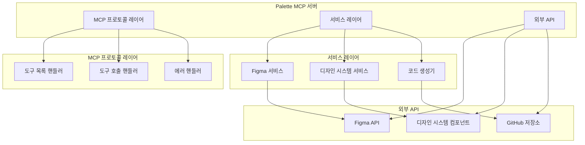
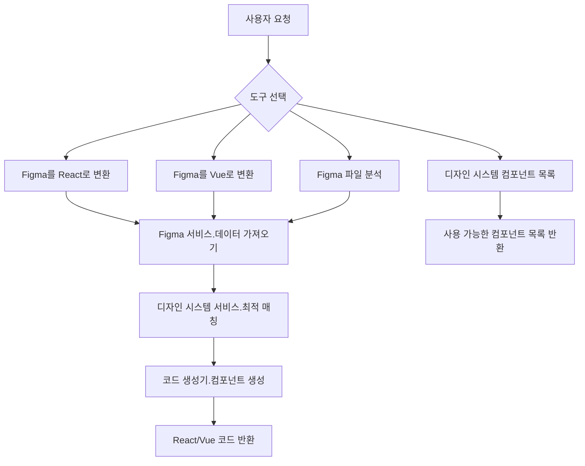
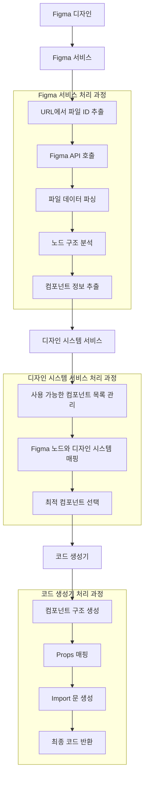
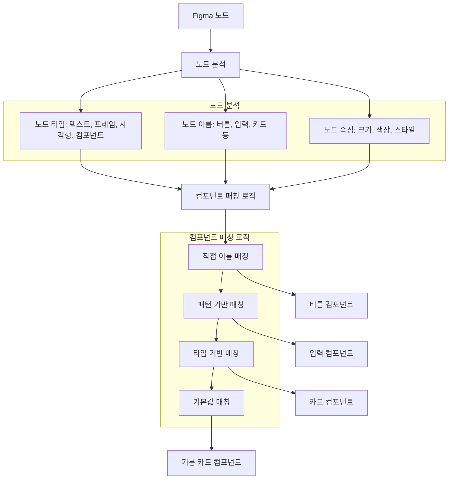
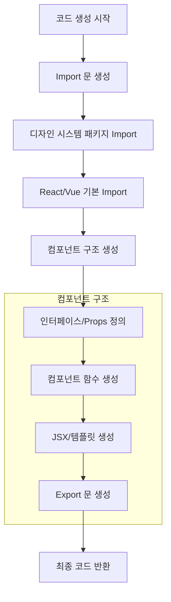
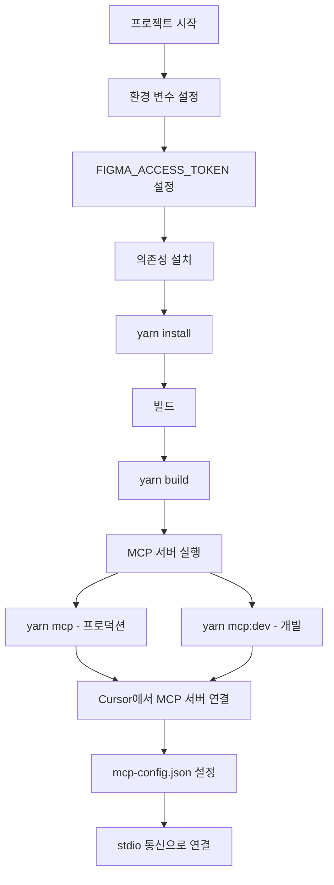
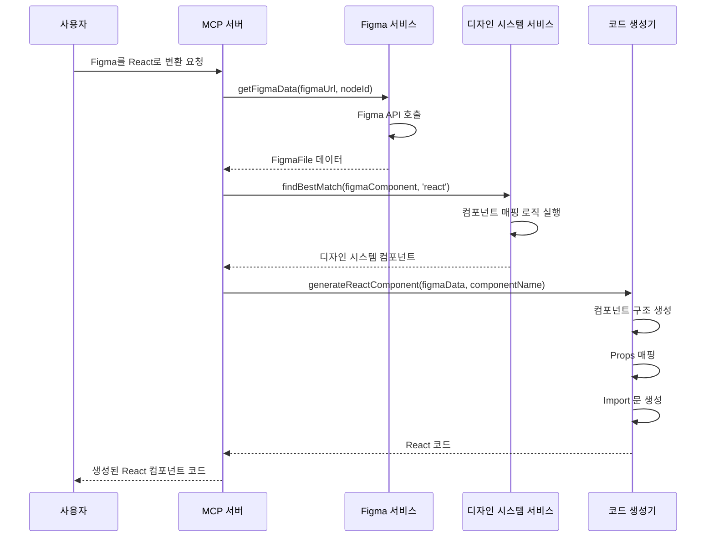
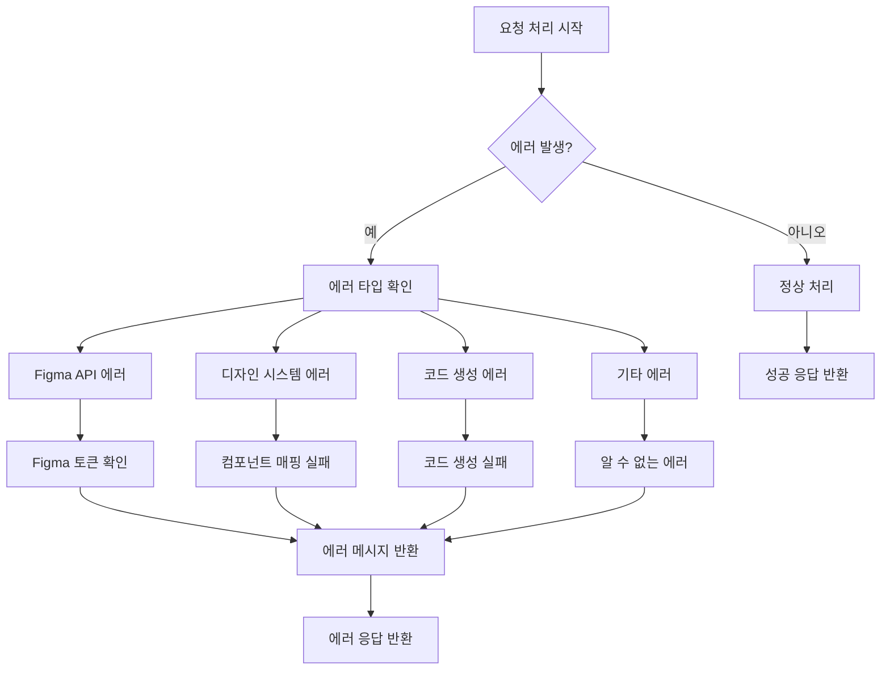

# Palette 프로젝트 구동 로직 다이어그램

## 1. 전체 시스템 아키텍처

## 2. 주요 도구(Tools) 흐름도

## 3. Figma → React/Vue 변환 과정

## 4. 컴포넌트 매핑 로직

## 5. 생성되는 코드 구조

## 6. 환경 설정 및 실행

## 7. 서비스 간 상호작용

## 8. 에러 처리 흐름

이 Mermaid 다이어그램들은 Palette 프로젝트의 전체적인 구동 로직을 시각적으로 보여줍니다. 각 다이어그램은 시스템의 다른 측면을 다루며, 프로젝트의 구조와 동작 방식을 명확하게 이해할 수 있도록 도와줍니다.
